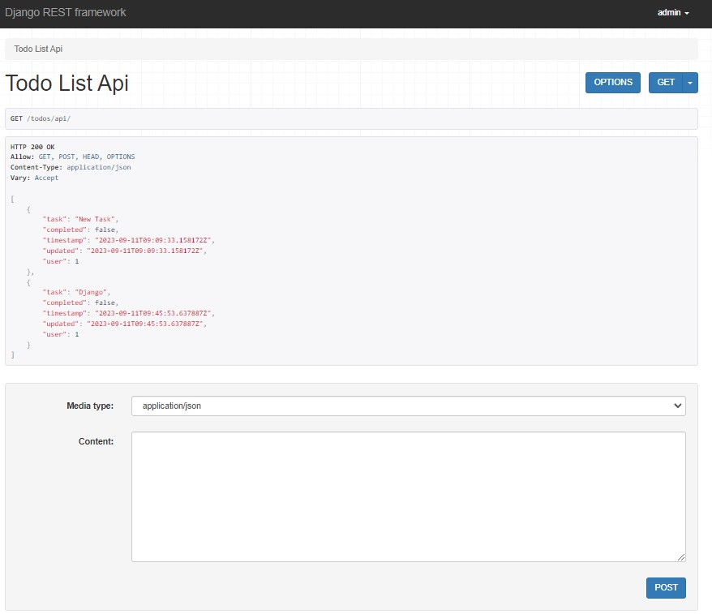
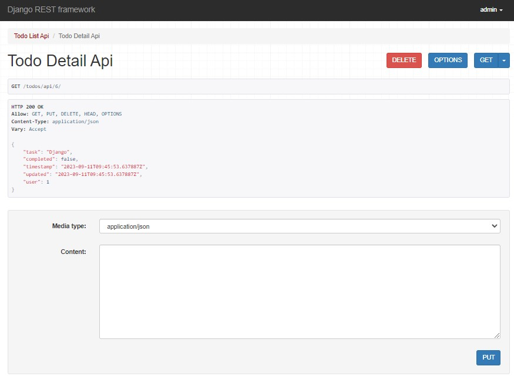
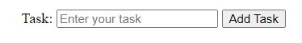

# REST API built with Django REST framework

For this app, we combine **Django** (a free, open source framework based on Python) with an **REST API** (representational state transfer API).

The combination takes places through the **Django REST framework** (DRF) toolkit.

Since Django utilizes a **Model-View-Template** (MVT) architectural pattern, the toolkit is able to use the **class-based views**.

The outcome is a fully functional **CRUD** Django REST API.

# Endpoints
Endpoints define the structure and usage for the GET, POST, PUT, and DELETE HTTP methods within an RESTful API.

This app uses two endpoints:
|Endpoint|GET|POST|PUT|DELETE|View|
|:--:|:--:|:--:|:--:|:--:|:--:|
|``todos/api``|1. List All: List all to-dos for requested user|2. Create: Add a new to-do|N/A|N/A|``TodoListApiView``|
|``todos/api/<int:todo_id>``|3. Retrieve: Get a to-do with given ``todo_id``|N/A|4. Update: Update a to-do with given ``todo_id``|5. Delete: Delete a to-do with given ``todo_id``|``TodoDetailApiView``|

These endpoints can simply be accessed via their specific urls e.g.:
`http://127.0.0.1:8000/todos/api/`

`http://127.0.0.1:8000/todos/api/2`

However, this code also feaures the possibility to submit a new entry via a form submission.

The form is located here: `http://127.0.0.1:8000/`

The associated view is `contact` which renders a from for the `todo` model and checks if it is valid.

The `@login_required` decorators ensures that only a logged in user can access the form. The logged in user is then automatically associated with the user's submitted task.

# Model serializer
The conversion of an Model object into an API-usable format (e.g. JSON) is done via a serializer. The Django REST framework does this via the ModelSerializer class (see `serializers.py`).

# Source
The code is based on tutorials: 
- [How to create a REST API with Django REST framework](https://blog.logrocket.com/django-rest-framework-create-api/)
- [Django And Fetch API Form Submissions –Without Page Reloading](https://ridwanray.medium.com/django-and-fetch-api-form-submissions-without-page-reloading-dc5106598005)
